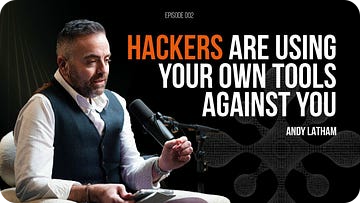

<h1>Ruben Clarke </h1> 

#### GRC Engineer & Information Security Consultant | ISO 27001, 27701 & 42001 Lead Auditor

I help organisations turn compliance requirements into effective governance frameworks, robust security controls, and repeatable processes that stand up to audit. My work focuses on ISO 27001, ISO 27701 and ISO 42001, GDPR, cloud security, and compliance as code. Combining experience from the armed forces, B2C marketing, and information security, I bring a structured approach to risk management that balances security, compliance, and business objectives.

### 📜 Certifications & Education

- 🎓 **Certified GRC Engineer, Auditor Specialty (CGE-AUD)**
- 🎓 **ISO/IEC 42001 AI Management Systems (AIMS) Lead Auditor** 
- 🎓 **ISO/IEC 27701 Privacy Information Management Systems (PIMS) Lead Auditor** 
- 🎓 **ISO/IEC 27001 Information Security Management Systems (ISMS) Lead Auditor** 
- 🎓 **ISO/IEC 27001 Information Security Management Systems (ISMS) Lead Implementer**

### 💼 Featured Work

<table>
<tr>
<td width="50%" valign="top">

**ISMS Risk & Control Assurance**
*Seven-Client Portfolio*

Risk assessment, control mapping and internal audit across seven concurrent clients, covering defence supply chain, SaaS, research, nonprofit and professional services. Every control traces from the Statement of Applicability through to audit findings and closed corrective actions.

</td>
<td width="50%" valign="top">

**Technical Evidence Review**
*Cloud-First ISMS Engagements*

AWS configuration, Terraform and pipeline settings read directly as control evidence, rather than taking a written description at face value. Covers IAM and MFA, CloudTrail, encryption, S3 exposure and branch protection, mapped back to ISO/IEC 27001 Annex A.

</td>
</tr>
<tr>
<td width="50%" valign="top">
 
**🔗 Threat Hunting Labs**
*Microsoft Defender for Endpoint*
 
Simulated attack scenarios on Windows endpoints, hunted using KQL across file, process and network telemetry. Each one written up as a full report with the queries used, a reconstructed timeline of the activity and the response actions taken.
 
</td>
<td width="50%" valign="top">

**🔗 Arcane Link**
*Podcast*

Interviews with security practitioners about what the job actually involves: the politics, the tedium, and what people wish they had known before they started. The parts that never make it into a job description, a certification syllabus or a conference talk.

</td>
</tr>
</table>

<!-- SUBSTACK-RECENT-ARTICLES:START -->
<!--
### 📰 Latest Substack Articles

<b>The Calm in the Chaos</b> 
Oct 6, 2026 
In the world of information security, the true test of a leader doesn&#x27;t happen during a successful audit.
 

<b>Cyber Insurance Explained</b> 
Oct 6, 2026 
In business, there are certain things you buy because you have to. Insurance usually sits somewhere near the top of that list. It’s not...
 

<b>Defence At Speed With Ai</b> 
Oct 6, 2026 
There was a time, not very long ago, when an annual pen test, decent firewall, and a folder of policies was a perfectly respectable answer...
 
-->
<!-- SUBSTACK-RECENT-ARTICLES:END -->

    

